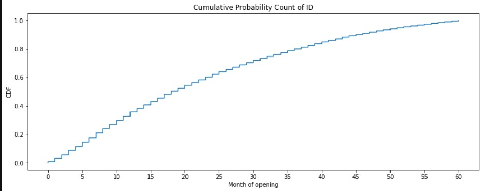

# Vintage_Analysis

## 1. Dataset Source
https://www.kaggle.com/rikdifos/credit-card-approval-prediction

## 2. Package Requirement
pandas, numpy, plotly, matplotlib, statsmodels

## 3. Details
Objective : Quantify risk on a loan application and get an insight about how long good users start to become default users.

Vintage Analysis measures portfolio performance for different periods of registration. Basically, it's concern about loan/credit risk and a certain time period. Banking often used vintage analysis to quantify the credit risk of customers. Furthermore, it could help to create a target label for a supervised machine learning problem. We can identify how many months from the registration date that customers will change their status to default/bad credit. Bad credit defines as customers that overdue their credit card debt more than 90 days or with status 3, 4, or 5.

## 4. Result

## 5. Reference
https://www.listendata.com/2019/09/credit-risk-vintage-analysis.html
