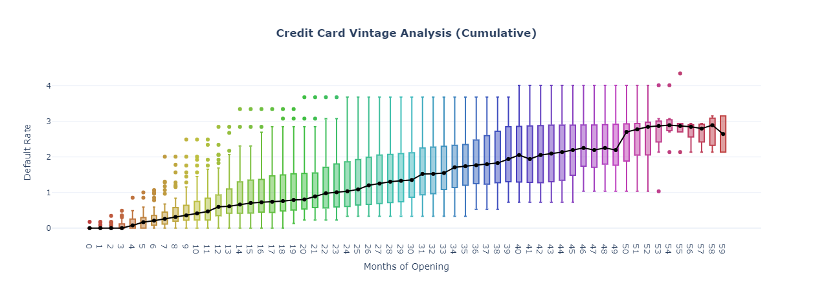

# Vintage_Analysis

## 1. Dataset Source
https://www.kaggle.com/rikdifos/credit-card-approval-prediction

## 2. Package Requirement
pandas, numpy, plotly, matplotlib, statsmodels

## 3. Details
Objective : Quantify risk on a loan application and get an insight about how long good users start to become default users.

Vintage Analysis measures portfolio performance for different periods of registration. Basically, it's concern about loan/credit risk and a certain time period. Banking often used vintage analysis to quantify the credit risk of customers. Furthermore, it could help to create a target label for a supervised machine learning problem. We can identify how many months from the registration date that customers will change their status to default/bad credit. Bad credit defines as customers that overdue their credit card debt more than 90 days or with status 3, 4, or 5.

## 4. Result

First, we need to understand the data by seeing the distribution of account age. The plot above gives information about the percentage of ID based on account age with account age in the x-axis and cumulative distribution function in the y-axis. For example, when the x-axis is 10 and the y-axis is around 0,2 to 0,3, it means there are around 20-30% of ID with age less than or equal 10 months. 

Second, we need to choose time period that increase significantly. The plot above gives information about proportion of default/bad credit in a certain time period. Every dot in boxplot represent proportion of default credit for every months of books.

## 5. Reference
https://www.listendata.com/2019/09/credit-risk-vintage-analysis.html
